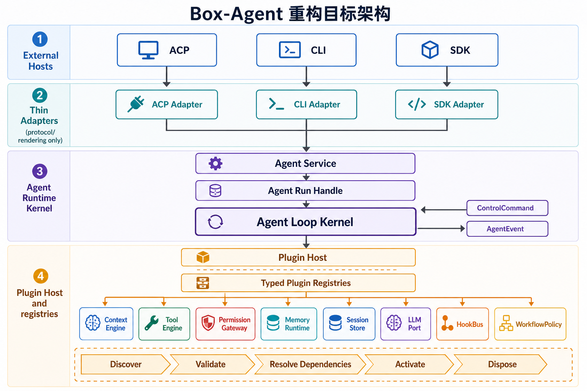

<p align="center">
  <h1 align="center">Box Agent</h1>
  <p align="center">通用 AI Agent 框架，支持沙箱代码执行、子 Agent 并行和多 LLM 提供商。</p>
</p>

<p align="center">
  <a href="https://pypi.org/project/box-agent/"></a>
  <a href="https://pypi.org/project/box-agent/"></a>
  <a href="https://pypi.org/project/box-agent/"></a>
  <a href="https://github.com/Raccoon-Office/Box-Agent/blob/main/LICENSE"></a>
  <a href="https://github.com/Raccoon-Office/Box-Agent/releases"></a>
</p>

<p align="center">
  <a href="./README.md">English</a> | 中文
</p>

---

**30 秒快速上手：**

```bash
uv tool install box-agent   # 或: pip install box-agent (需 Python 3.10+)
box-agent setup              # 交互式配置向导
box-agent                    # 开始对话
```

或执行单次任务：

```bash
box-agent --task "分析 sales.csv — 按收入展示前 10 名产品的柱状图"
```

---

## 为什么选择 Box Agent？

大多数 Agent 框架要么太简单（无沙箱、无工具），要么太复杂（依赖臃肿、架构僵化）。Box Agent 恰好取得了平衡：

| 特性                 | Box Agent                                           | Open Interpreter     | Aider              |
| -------------------- | --------------------------------------------------- | -------------------- | ------------------ |
| 沙箱代码执行         | 隔离 venv 中的 Jupyter 内核                         | 在宿主 Python 中运行 | 不支持             |
| 子 Agent 并行        | 多个子 Agent 并发运行                               | 不支持               | 不支持             |
| 多 LLM 提供商        | Anthropic、OpenAI、DeepSeek、SiliconFlow 及任何 API | OpenAI + 少量其他    | OpenAI + Anthropic |
| MCP 工具集成         | 原生支持                                            | 不支持               | 不支持             |
| ACP 协议（嵌入应用） | 完整支持                                            | 不支持               | 不支持             |
| 独立二进制           | PyInstaller 运行时，无需 Python                     | 不支持               | 不支持             |
| 上下文压缩           | 分阶段自动压缩 + LLM 摘要                            | 手动                 | 基于 Git           |

## 核心特性

### 子 Agent 并行

通过扁平任务契约把隔离工作委派给子 Agent，可选声明工具、Skills、文件、写入范围
以及步骤/工具调用硬预算。省略工具时只解析可信本地只读工具；显式能力仍经过
fail-closed 运行时策略。把多个已知本地文本路径放入 `files`，且最终只解析出
`read_file` 时，会自动使用有完整性校验
的批量快速路径。父 Agent 始终负责冲突处理、最终交付物和验证。

```
用户: "分别分析 data1.csv、data2.csv 和 data3.csv，然后给出综合总结"

┌─ 子 Agent 1 ──────┐  ┌─ 子 Agent 2 ──────┐  ┌─ 子 Agent 3 ──────┐
│ 读取 data1.csv      │  │ 读取 data2.csv      │  │ 读取 data3.csv      │
│ 运行统计分析        │  │ 运行统计分析        │  │ 运行统计分析        │
│ 生成图表            │  │ 生成图表            │  │ 生成图表            │
│ → 摘要: ...         │  │ → 摘要: ...         │  │ → 摘要: ...         │
└─────────────────────┘  └─────────────────────┘  └─────────────────────┘
                              ↓ 并行 ↓
                    ┌─ 父 Agent ────────────┐
                    │ 汇总 3 份摘要          │
                    │ 生成最终报告           │
                    └─────────────────────────┘
```

子级策略由运行时派生：进程工具、外部副作用和未知 MCP fail closed，路径写入必须
提供精确范围。完整 schema、限制和宿主诊断见
[子 Agent 委派契约](docs/SUB_AGENT_DELEGATION_CN.md)。

### 沙箱代码执行

Python 运行在隔离的 Jupyter 内核中，预装数据科学包（`pandas`、`numpy`、`matplotlib`、`scikit-learn`、`openpyxl`、`xlrd`）。生成的文件（图表、CSV、PDF）会被自动检测并以结构化 Artifact 呈现。

### 多 LLM 提供商

一份配置，任意切换：

```yaml
# Anthropic
api_base: "https://api.anthropic.com"
provider: "anthropic"
model: "claude-sonnet-4-20250514"

# DeepSeek
api_base: "https://api.deepseek.com"
provider: "openai"
model: "deepseek-chat"

# 任何 OpenAI 兼容端点
api_base: "https://your-api.example.com/v1"
provider: "openai"
model: "your-model"
```

### 分阶段上下文压缩

- **超大工具结果**：需要时立即把单项结果持久化；同一次请求中的并行新结果共享 50k 字符预算。模型只接收稳定预览，完整文本留在磁盘。读取类结果由 Read 自身的行数/字符限制控制，不走这层压缩。
- **基于真实用量的自动摘要**：根据最近一次 API 实际用量和后续消息估算下一次请求；达到模型推导的安全阈值时，将较旧历史摘要为一条 `user` 消息，同时恢复有界的近期消息、Todo、Plan 与 Skill 状态。
- **工具调用参数**：write/edit 参数在整段历史摘要替换其所在轮次前始终保留原文，不再被单独替换为占位符。
- **旧历史安全保护**：如果模型错误地把旧版或外部 session 中的内部历史占位符当成文件或代码参数复用，Box-Agent 会拒绝执行并请求一次干净重生成，避免占位符被写入磁盘。

### 更多特性

- **MCP 工具**：接入任何 [MCP 服务器](https://github.com/modelcontextprotocol/servers) — 网页搜索、知识图谱、数据库
- **Skills 与 SkillHub**：内置清单由 `_manifest.json` 管理；宿主协商 `skillhub_search` / `skillhub_install` 后，还可按 Run 搜索并经用户确认安装市场 Skill
- **可靠演示文稿**：受控 PPTX 工作流保存 pending chunk checkpoint，恢复后继续写入；Shell/Jupyter 入口同时阻止绕过 self-check 和图片状态同步
- **模型档案**：宿主可用不可变的 `profileId + profileRevision` 选择 Provider/端点；凭据在调用时解析，不进入 Session 元数据或事件
- **ACP 协议**：通过 JSON-RPC over stdio 将 Box Agent 嵌入 Electron 应用、Zed 编辑器或任何 ACP 兼容宿主
- **独立运行时**：PyInstaller 二进制打包 Python 及所有依赖。无需外部 Python — 下载即用
- **跨会话记忆**：持久化记忆让 Agent 在多次对话间保留关键信息
- **安全防护**：危险命令检测、工作区范围控制、文件修改前自动备份。工作区外访问支持交互式权限协商（CLI 终端询问用户，ACP 反向 RPC 询问宿主）
- **结构化计划**：内置 Plan 工具，支持宿主渲染目标、范围、步骤、验证方式和风险
- **任务追踪**：内置 Todo 工具，支持多步骤任务分解与进度跟踪

## 运行时架构

Box Agent 只有一个执行所有者。CLI、ACP、SDK、子 Agent 和历史 Python API
都会把稳定的 `box_agent.api` 契约提交给 `KernelAgentService`，只有
`AgentLoopKernel` 能推进 Run。宿主适配器只做协议转换与事件渲染；每次 Run
所需能力从 `PluginHost` 的类型化注册表中解析。



```text
CLI / ACP / SDK / 历史 API
            ↓
薄适配器或兼容 facade
            ↓
KernelAgentService → PluginKernelComposer → AgentLoopKernel
            ↓
Context · Tools · Permissions · Memory · Persistence · LLM · Workflows · Hooks
```

| 分层 | 职责 |
| --- | --- |
| `box_agent/api/` | 可序列化的请求、事件、结果、控制命令、句柄与能力端口 |
| `box_agent/kernel/` | 唯一执行循环、模型流/恢复和每次 Run 的工作流组合 |
| `box_agent/services/` | Session/Run 生命周期、重放、幂等、控制、检查点与租约 |
| `box_agent/plugins/` | 类型化注册表、manifest、依赖激活、释放与 plugin lock |
| `box_agent/adapters/` / `box_agent/acp/` | CLI、ACP、SDK 的协议转换或渲染，不维护第二套循环 |
| 能力包 | `context/`、`memory_engine/`、`permissions/`、`persistence/`、`tools/`、`workflows/`、`llm/` |
| `box_agent/compat/` 与根目录 facade | 保留历史导入/调用形状，但统一转发到同一个 Kernel |

旧的 pre-Kernel runtime selector 已退役。Goal、Plan、PPT、Skill、Completion
Gate 和 Autopilot 均作为 Workflow Plugin 运行，并有 parity fixture 覆盖。完整
归属关系见[架构说明](docs/ARCHITECTURE_CN.md)、
[运行时能力矩阵](docs/runtime-capability-matrix.md)和[文档索引](docs/README.md)。
逐文件理解代码时请看[代码导览](docs/CODEBASE_MAP_CN.md)。

## 演示

### 任务执行

_Agent 创建网页并在浏览器中打开。_


### Claude Skill — PDF 生成

_Agent 使用技能创建专业文档。_


### MCP 网页搜索

_Agent 搜索网页并总结结果。_


## 安装

先按准备使用的入口选择安装方式：

| 目标 | 推荐安装方式 |
| ---- | ------------ |
| 使用交互 CLI、一次性 CLI 或 ACP 服务 | `uv tool install box-agent` |
| 在 Python 应用中嵌入 Box Agent | 在该应用中运行 `uv add box-agent` |
| 开发 Box Agent 或构建独立运行时 | 克隆本仓库，然后运行 `uv sync --group dev` |
| 在宿主中嵌入已发布的独立 ACP 运行时 | 下载 Release 压缩包；不需要系统 Python |

Python 包需要 Python 3.10+；独立运行时已经内置 Python 和依赖。

### 安装命令行工具（推荐）

[uv](https://docs.astral.sh/uv/) 会自动管理 Python 版本，无需升级系统 Python：

```bash
# 安装 uv（如尚未安装）
curl -LsSf https://astral.sh/uv/install.sh | sh

# 安装 Box Agent（如需要会自动下载 Python 3.10+）
uv tool install box-agent

# 生成 CLI/ACP 共用的 LLM、MCP 配置并检查环境
box-agent setup
box-agent doctor

# 启动交互式 CLI
box-agent

# 后续升级
uv tool upgrade box-agent
```

如果已经在管理 Python 3.10+ 虚拟环境，也可以在环境中运行 `pip install
box-agent`；它会在该环境中提供同一组命令。

### 安装 Python SDK

在需要导入 Box Agent 的 Python 应用中添加依赖：

```bash
uv add box-agent
```

或者在已激活的 Python 3.10+ 虚拟环境中运行：

```bash
pip install box-agent
```

`uv tool install` 使用隔离的工具环境，适合安装命令，但不会把 `box_agent`
加入另一个应用的 import path。

### 从源码运行

```bash
git clone https://github.com/Raccoon-Office/Box-Agent.git
cd Box-Agent
uv sync
uv run box-agent setup
uv run box-agent
```

在源码 checkout 中，所有 console command 前加 `uv run`。测试或打包前再安装
开发依赖：`uv sync --group dev`。

### 入口速查

| 入口 | 安装后的命令 | 源码 checkout 命令 | 调用方 |
| ---- | ------------ | ------------------ | ------ |
| 交互与一次性 CLI | `box-agent` | `uv run box-agent` | 用户、Shell 脚本或 CI |
| ACP 服务 | `box-agent-acp` | `uv run box-agent-acp` | 通过 stdio 使用 ACP 的编辑器或应用 |
| Python SDK | 导入 `box_agent` | `uv run python your_app.py` | Python 应用代码 |
| Web Extract MCP 服务 | `box-agent-web-extract-mcp` | `uv run box-agent-web-extract-mcp` | 通过 stdio 使用 MCP 的客户端 |
| 独立运行时构建器 | — | `uv run box-agent-build-runtime` | 在源码 checkout 中打包 ACP 服务的维护者 |

`box-agent-acp` 和 `box-agent-web-extract-mcp` 都是协议服务，通常应配置宿主
去拉起它们，而不是在终端里输入内容。下文分别给出各入口的启动契约。

## 新协作者快速开始

如果你是新加入的协作者，改代码前先从这里开始：

```bash
git clone https://github.com/Raccoon-Office/Box-Agent.git
cd Box-Agent
uv sync
uv run python -m box_agent.cli --help
uv run pytest tests/test_agent_loop_kernel.py tests/test_kernel_service.py -q
```

建议先读这几个文件：

- `AGENTS.md` — 仓库本地开发规则、范围控制和验证要求。
- `CONTRIBUTING_CN.md` — 贡献流程、PR checklist 和提交信息格式。
- `docs/REVIEW_GUIDE_CN.md` — 维护者 review 顺序、阻塞项和 proof 要求。
- `docs/DEVELOPMENT_GUIDE_CN.md` — 更完整的架构与开发说明。
- `docs/INTEGRATION.md` — ACP / 独立运行时与宿主应用集成说明。

项目地图：

| 模块 | 入口文件 |
| ---- | -------- |
| 稳定宿主契约 | `box_agent/api/` |
| Agent 执行循环 | `box_agent/kernel/` |
| Session 与 Run 生命周期 | `box_agent/services/kernel.py` |
| Plugin 组合 | `box_agent/plugins/`、`box_agent/adapters/plugin_host.py` |
| CLI 与配置 | `box_agent/adapters/cli/app.py`、`box_agent/config.py`、`box_agent/config/` |
| LLM Provider | `box_agent/llm/` |
| 能力实现 | `box_agent/context/`、`box_agent/memory_engine/`、`box_agent/permissions/`、`box_agent/persistence/`、`box_agent/tools/`、`box_agent/workflows/` |
| ACP 与 SDK 适配 | `box_agent/acp/`、`box_agent/adapters/` |
| 历史兼容层 | `box_agent/compat/` 与根目录 module facade |
| 运行时打包 | `box_agent/build_runtime_cli.py`、`scripts/build_runtime.py` |
| Skills | `box_agent/skills/`、`box_agent/tools/skill_loader.py` |
| 测试 | `tests/test_<area>.py` |

完整的核心目录、源文件和调用链说明见[代码导览](docs/CODEBASE_MAP_CN.md)。

日常开发循环：

```bash
# 迭代时先跑最小相关测试
uv run pytest tests/test_bash_tool.py -q

# 交付前跑更宽的测试
uv run pytest tests/ -q

# 检查空白字符和 patch 格式问题
git diff --check
```

按改动范围选择测试：工具改动看 `tests/test_*_tool.py`，LLM 行为看
`tests/test_llm*.py` / `tests/test_error_messages.py`，ACP 看
`tests/test_acp*.py`，memory 看 `tests/test_memory*.py`，运行时打包看
`tests/test_build_runtime.py` / `tests/test_cli_runtime.py`。需要真实 provider
凭据的 integration 测试在没有对应 API key 时会跳过。

如果改动会影响宿主应用使用的独立运行时，只改源码还不够：需要重新打包运行时、
安装到宿主应用、重启正在运行的 ACP 进程，然后探测已安装的运行时。本地打包命令：

```bash
uv run box-agent-build-runtime
```

构建带版本号的运行时并安装到常用 officev3 checkout：

```bash
uv run box-agent-build-runtime --version 0.9.6 --install-officev3
```

officev3 位于其他目录时，在 `--install-officev3` 后传入明确路径，或设置
`BOX_AGENT_OFFICEV3_DIR`。

## 配置

运行 `box-agent setup` 后，配置文件位于 `~/.box-agent/config/config.yaml`：

```yaml
api_key: "your-api-key"
api_base: "https://api.anthropic.com"
model: "claude-sonnet-4-20250514"
provider: "anthropic" # "anthropic" 或 "openai"
max_steps: 300
max_parallel_tools: 8
parallel_tool_timeout_seconds: 900
provider_stale_seconds: 300
sub_agent_token_limit: 50000
sub_agent_batch_synthesis_timeout_seconds: 600 # 设为 0 可关闭额外综合超时
goal_autopilot_enabled: true
goal_autopilot_max_turns: 3
goal_autopilot_max_seconds: 14400
goal_autopilot_no_progress_turns: 2
tools:
  # bash_default_timeout_seconds: 300
  # bash_max_timeout_seconds: 1200
  mcp:
    connect_timeout: 60
    execute_timeout: 120
    sse_read_timeout: 180
```

```bash
box-agent config                    # 查看当前配置摘要
box-agent config --get model        # 打印单个配置值
box-agent config --set max_steps 300
box-agent config --set goal_autopilot_max_turns 5
box-agent config --set tool_limits.external_skill.max_tool_calls 160
box-agent config --set tool_limits.external_skill.max_delegated_tool_calls 512
box-agent config --set tools.bash_default_timeout_seconds 450
box-agent config --json             # 机器可读配置摘要
box-agent config --edit             # 用编辑器打开配置
box-agent doctor                    # 检查环境与 API 连通性
box-agent doctor --json             # 机器可读健康检查
```

## CLI 入口

所有 CLI 模式都使用 `box-agent setup` 生成的配置。用 `--workspace` 指定 Agent
可以工作的目录；不传时使用当前目录。

### 1. 交互式 CLI

```bash
box-agent
box-agent --workspace /path/to/project
box-agent --no-sandbox           # 关闭 Jupyter 沙箱
```

会话内命令：`/help`、`/clear`、`/clear_all`、`/history`、`/stats`、
`/sandbox_status`、`/log`、`/goal`、`/memory review`、`/exit`。

### 2. 脚本与 CI 使用的一次性 CLI

`--task` 执行一次请求后退出；调用方需要机器可读的执行摘要时再加 `--json`。

```bash
box-agent --task "分析 data.csv 并生成报告"
box-agent --task "分析 data.csv" --json          # 追加执行摘要 JSON
box-agent --task "本地文件任务" --no-verify-api  # 跳过启动时 API 探测
box-agent --task "生成一份 PPT" --force-plan-start  # 工作前先发布计划
box-agent --task "生成一份 PPT" --no-completion-gate
box-agent --goal "补齐 CLI 能力" --task "跑完测试"
box-agent --goal "补齐 CLI 能力" --task "跑完测试" --no-goal-autopilot
box-agent --deep-think --task "审查这个仓库"      # 支持时启用 thinking 模式
```

使用 `--goal "<目标>"` 可以给当前工作区设置持久目标；目标保存在
`~/.box-agent/goals/`。一次性 CLI 和 ACP 会话可以在配置的轮次、时间及无进展
上限内自动续跑；单次执行可用 `--no-goal-autopilot` 关闭。

交互模式可用 `/goal pause`、`/goal resume`、`/goal block <原因>`、
`/goal complete <证据>` 或 `/goal clear` 管理目标；脚本可使用
`box-agent goal ...`。

### 3. 配置、健康检查与维护命令

```bash
box-agent setup             # 配置向导
box-agent config            # 查看/编辑配置
box-agent doctor            # 健康检查
box-agent log               # 打开日志目录
box-agent trace-viewer      # 打开离线 Agent Trace 诊断页面
box-agent goal status       # 查看当前工作区持久目标
box-agent goal complete --evidence "测试已通过"
box-agent install-browser   # 安装 Playwright MCP 所需 Chromium（约 200MB）
box-agent install-node      # 安装技能脚本使用的托管 Node.js 运行时（macOS）
```

### Agent Trace 诊断

运行 `box-agent trace-viewer` 可打开随包发布的离线开发者诊断页。打开 `~/.box-agent/log/sessions/` 可先查看按时间从新到旧排列的全部 trace 总览，再选择一次运行查看单轮指标、LLM/工具 Waterfall、原始事件，以及从 system prompt、user、assistant/tool 到 final response 的完整纵向链路；也可以直接打开单个 `.jsonl` 文件。

如果内置浏览器不提供原生文件选择器，可启动仅监听本机回环地址的服务，并在页面中输入 trace 目录路径：

```bash
uv run python -m box_agent.trace_viewer.server --port 8766
```

离线模式由浏览器直接读取文件；服务模式只读取输入目录当前层级的 `.jsonl` 文件，每秒检查一次文件元数据，并在文件新增或变化时刷新总览；只有元数据变化后才会通过 `127.0.0.1` 重新读取 trace 正文。服务会拒绝 `Host` 或 `Origin` 不是当前回环地址的请求，避免 DNS rebinding 页面读取本地 trace。两种模式都不会访问外部网络。Chromium 和 Edge 在用户授权文件句柄后可持续跟随新增记录；拖放和普通文件选择器加载的是静态快照。Session trace 可能包含 prompt、工具参数、输出和业务数据，应按敏感诊断资料处理。

## ACP、SDK 与打包运行时入口

### 4. 编辑器和应用使用的 ACP 服务

Box Agent 支持 [Agent Communication Protocol](https://github.com/nichochar/agent-client-protocol)，可嵌入编辑器和应用。

宿主需要拉起 `box-agent-acp`，再通过 stdio 上的 ACP JSON-RPC 与它通信。
stdin/stdout 只承载协议，诊断日志写入 stderr。如果宿主没有继承 Shell 的
`PATH`，macOS/Linux 用 `which box-agent-acp`、Windows 用
`where box-agent-acp` 找到绝对路径。

**Zed Editor** — 在 `settings.json` 中添加：

```json
{
  "agent_servers": {
    "box-agent": {
      "command": "/path/to/box-agent-acp"
    }
  }
}
```

从源码 checkout 使用时，可以把宿主命令配置为 `uv`，参数设为
`["run", "box-agent-acp"]`；也可以直接指向虚拟环境生成的
`box-agent-acp`。不要向这个进程直接输入自然语言文本。

### 5. Python SDK 嵌入

先用 `uv add box-agent` 或 `pip install box-agent` 安装依赖。SDK 与 ACP、CLI
共用同一套 Service 和事件契约，不会构造另一套
Agent 循环：

```python
import asyncio
import os

from box_agent import LLMClient, build_kernel_service
from box_agent.adapters import SDKServiceAdapter


async def main() -> None:
    llm = LLMClient(api_key=os.environ["ANTHROPIC_API_KEY"])
    service = build_kernel_service(llm=llm, tools=[])
    result = await SDKServiceAdapter(service).run(
        {"session_id": "session-1", "message": "解释这个项目的架构"}
    )
    print(result)


asyncio.run(main())
```

高级集成可把类型化能力端口注册到 `PluginHost`，再调用
`KernelAgentService.from_plugin_host(host)` 创建服务。直接构造 Kernel 只适用于
测试，或已经绑定全部 Run 级依赖的调用方。注册表、工作流、重放和控制示例见
[运行时能力矩阵](docs/runtime-capability-matrix.md)。

### 6. 独立 ACP 运行时

Electron 和其他不希望依赖系统 Python 的宿主使用这个入口：

```bash
# 下载预构建二进制（最新发布；省略 tag 即自动取最新版本）
gh release download --repo Raccoon-Office/Box-Agent --pattern "box-agent-runtime-*.tar.gz"

# 或从源码构建（当前平台）
uv run box-agent-build-runtime

# 在 Apple Silicon 上构建 macOS Intel/x64 运行时
# 需要单独的 x86_64 venv —— PyInstaller 无法把 arm64 wheel 塞进 x64 产物。
# 一次性准备：
#   arch -x86_64 /bin/bash -c 'curl -LsSf https://astral.sh/uv/install.sh | INSTALLER_NO_MODIFY_PATH=1 UV_INSTALL_DIR="$HOME/.local/bin-x64" sh'
#   UV_PROJECT_ENVIRONMENT=.venv-x64 arch -x86_64 ~/.local/bin-x64/uv sync
# 打包：
UV_PROJECT_ENVIRONMENT=.venv-x64 BOX_AGENT_RUNTIME_TARGET=darwin-x64 arch -x86_64 ~/.local/bin-x64/uv run box-agent-build-runtime
```

构建器会读取仓库内的脚本，因此必须先在源码 checkout 中运行
`uv sync --group dev`，再执行构建命令。压缩包中的宿主入口是
`box-agent-runtime/bin/box-agent-acp`（Windows 为 `.exe`）；宿主拉起它的方式与
已安装的 ACP 命令相同。运行时通过 JSON-RPC over stdio 通信：stdout 只承载
协议，stderr 用于诊断。

### 7. Web Extract MCP 服务

这个入口向 MCP 客户端提供 `web_extract` 工具。源码或 Python 包安装会提供
`box-agent-web-extract-mcp`，把它加入客户端的 stdio MCP 配置并由客户端拉起。
例如 Box Agent 的 `~/.box-agent/config/mcp.json` 格式为：

```json
{
  "mcpServers": {
    "box-agent-web-extract": {
      "command": "/absolute/path/to/box-agent-web-extract-mcp",
      "args": [],
      "alwaysLoad": true,
      "disabled": false
    }
  }
}
```

服务通过 HTTP(S) 获取公开网页且不执行 JavaScript；长页面需要摘要时，会读取
Box Agent 的 LLM 配置。独立运行时的 `manifest.json` 已声明同一服务，并通过
`bin/box-agent-acp --web-extract-mcp` 拉起；宿主应消费 manifest，不要再虚构一个
打包后的独立命令。其他 MCP 客户端可以使用不同的字段名表达同一个命令和 stdio
传输方式。

## 测试

```bash
uv run pytest tests/ -v          # 所有测试
uv run pytest tests/test_agent_loop_kernel.py tests/test_context_engine.py tests/test_context_compaction_e2e.py -v
uv run pytest --cov              # 带覆盖率
```

运行无需凭据的 ACP 端到端验收并查看可视化事件报告：

```bash
uv run python tests/e2e/run_acp_cases.py --report tests/e2e/report.json
uv run pytest tests/e2e -q
uv run python -m http.server 8765 --directory tests/e2e
```

浏览器打开 `http://localhost:8765/report.html`；报告覆盖文本、权限、Context/Memory
插件、工作流续跑和持久化恢复。详见 [ACP E2E 指南](docs/e2e/ACP_E2E_GUIDE_CN.md)。

## 常见问题

**SSL 证书错误**：`pip install --upgrade certifi` 或在测试环境设置 `verify=False`。

**模块未找到**：确保在项目目录下运行：`cd Box-Agent && uv run python -m box_agent.cli`

## 贡献

欢迎提交 Issue 和 Pull Request！详见[贡献指南](CONTRIBUTING_CN.md)。

## 许可证

[MIT](LICENSE)

## 链接

- [文档索引](docs/README.md)
- [PyPI](https://pypi.org/project/box-agent/) · [GitHub](https://github.com/Raccoon-Office/Box-Agent) · [Releases](https://github.com/Raccoon-Office/Box-Agent/releases)
- [Anthropic API](https://docs.anthropic.com/claude/reference) · [MCP Servers](https://github.com/modelcontextprotocol/servers) · [ACP Protocol](https://github.com/nichochar/agent-client-protocol)

---

**如果这个项目对你有帮助，请给它一个 ⭐！**
