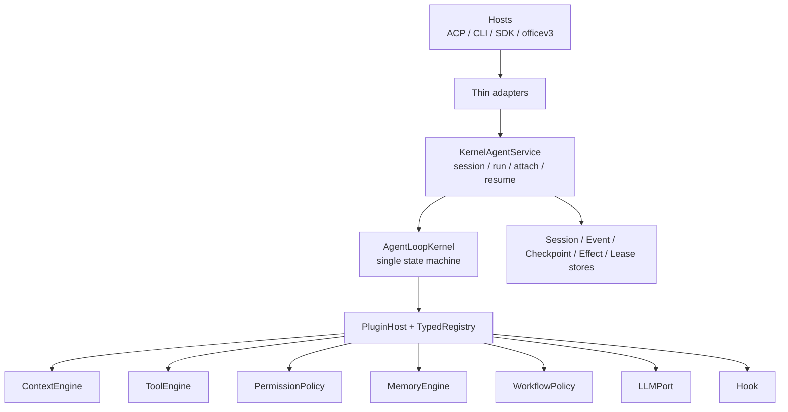

# Box-Agent Architecture

## Core rule

Box-Agent has one execution owner: `AgentLoopKernel`. ACP, CLI, SDK,
officev3, and the historical `Agent.run_events()` API are adapters. Context,
tools, permissions, memory, workflows, hooks, LLMs, and persistence are
registered plugins; product behavior does not live in the loop.



Dependencies point downward. The Kernel does not import ACP, CLI, officev3,
or a concrete workflow. Root `agent`, `core`, and `runtime` modules preserve
historical imports but execute through the same Kernel. The pre-Kernel loop is
retired.

## Directory ownership

| Path | Responsibility |
| --- | --- |
| `api/` | Stable DTOs, events, commands, errors, ports, and handles |
| `kernel/` | The only Agent loop and per-run composer |
| `services/` | Session/run lifecycle, replay, leases, and controls |
| `plugins/` | Manifests, typed registries, dependencies, activation/disposal |
| `context/` | ContextEngine, contributors, compaction, resource ledger |
| `tools/` | Tool plugins, ToolEngine, MCP exposure, workspace safety |
| `permissions/` | Fail-closed permission decision before execution |
| `memory_engine/` | Memory SPI, durable store, maintenance, and composition |
| `workflows/` | Goal, Plan, PPT, Skill, Completion Gate, Autopilot policies |
| `persistence/` | Session, event, checkpoint, effect, and lease stores |
| `llm/` | Provider adaptation, streaming, capabilities, routing |
| `adapters/` | ACP/CLI/SDK translation; `cli/app.py` owns the CLI implementation |
| `acp/` | Lightweight ACP handshake and transport-independent Kernel assembly |
| `compat/` | Historical call shapes translated to stable Kernel contracts |
| `observability/` | Logging, tracing, and redaction hooks |

Important files:

| File | Single responsibility |
| --- | --- |
| `api/contracts.py` | Run, message, tool, usage, artifact, session DTOs |
| `api/workflows.py` | Workflow action and checkpoint DTOs; `api/ports.py` is the only WorkflowPolicy definition |
| `api/events.py` | Ordered durable `AgentEvent` envelope |
| `api/controls.py` | External command and idempotent ACK |
| `api/ports.py` | Context/Tool/Permission/Memory/LLM/Hook/Workflow SPIs |
| `api/handles.py` | `AgentLoop`, `AgentService`, and `AgentRunHandle` |
| `kernel/loop.py` | Context → model → tools → continuation → terminal |
| `kernel/composer.py` | Resolve run-scoped components from PluginHost |
| `kernel/workflow_composite.py` | Generic fan-out across registered workflow policies |
| `services/kernel.py` | Session/run ownership, event commit, lease, recovery |
| `plugins/builtins.py` | One built-in workflow/plugin composition shared by ACP and CLI |
| `tools/engine.py` | Validate → permission → hook → effect → execute |
| `persistence/sqlite.py` | Transactional runtime fact store |
| `compat/runtime.py` | Translate historical arguments/events; no second loop |
| `adapters/cli/app.py` | CLI commands, interaction, and event rendering over the Service |
| `acp/bootstrap.py` | Establish stdio and answer the handshake before loading heavyweight capabilities |
| `acp/kernel_runtime.py` | Assemble `KernelACPRuntime` from config/plugins without owning transport or another loop |
| `llm/__init__.py`, `llm/llm_wrapper.py` | Keep the LLM facade lightweight and load only the selected provider SDK when its client is created |
| `llm/model_profiles.py`, `llm/binding.py` | Validate immutable model profiles and bind a provider per run without persisting credentials |
| `memory_engine/store.py` | Long-term memory indexing, retrieval, and writes |
| `memory_engine/maintenance.py` | Memory consolidation and maintenance jobs |
| `context/experts.py`, `evidence.py` | Expert context contribution and evidence normalization |
| `workflows/completion.py`, `guards.py`, `delivery.py` | Delivery intent, completion gates, and pure policy decisions |
| `tools/skillhub_*` | Add host-negotiated SkillHub search/confirmed install through composition, never Kernel branches |
| `tools/pptx_safety.py`, `workflows/presentation_checkpoint.py` | Tool-level PPTX bypass guards and restart-safe pending-write checkpoints |
| `workflows/execution_profile.py`, `turn_policy.py` | Execution profile and turn classification |
| `persistence/artifacts.py`, `roadmap_artifacts.py` | Artifact protocol, naming, scanning, and metadata validation |
| `observability/logger.py`, `session_trace.py`, `cache_fingerprint.py` | Redactable logs, session traces, and request fingerprints |
| `compat/events.py`, `hooks.py` | Historical event/hook shapes at the compatibility boundary |

For the full per-file runtime inventory, see the [codebase map](CODEBASE_MAP_CN.md).

## Public protocol

```python
session = await service.open_session(SessionOpenRequest(session_id="s1"))
handle = await service.start(RunRequest(
    request_id="req-1",
    session_id=session.session_id,
    turn_id="turn-1",
    user_input=Message.user("summarize the workspace"),
    options=RunOptions(workflow_id="completion_gate"),
))

async for event in handle.events(after_sequence=0):
    render(event)
result = await handle.wait()
```

- Input: immutable `RunRequest` with session, turn, message, attachments, and
  data-only `RunOptions`.
- Stream output: monotonically sequenced, replayable `AgentEvent` values.
- Terminal output: `RunResult` with content, stop reason, usage, artifacts,
  and metadata.
- Control: `handle.send(ControlCommand(...))`; `command_id` is idempotent.
- Ownership: `attach(run_id)` observes; `resume(run_id)` explicitly acquires a
  worker lease.

The Tool boundary is fixed: schema validation → permission preflight →
`Hook.before_tool` → revalidation after mutation → effect fence → executor →
`Hook.after_tool` → normalized result. Permission is therefore always decided
before an executor can run.

## Plugin composition

Primary registries include `llm`, `context`, `context.contributors`, `memory`,
`tools.descriptors`, `tools.executors`, `tools.engines`,
`tools.session_contributors`, `permissions`, `workflows`,
`workflow.selectors`, `hooks`, `sessions`, `events`, `checkpoints`, `effects`,
`leases`, `control.routes`, `host.extensions`, and `host.projections`.
Historical short names (`llm`, `context`, `tools`, `memory`, `permissions`)
are object aliases of their canonical typed registries, so registration,
hot reload, disposal, and replay locks have one source of truth.

```python
host = PluginHost()
host.registries["llm"].register("default", my_llm, source="acme.llm")
host.registries["context"].register("default", my_context, source="acme.context")
host.registries["memory"].register("default", my_memory, source="acme.memory")
host.registries["tools.executors"].register(
    "ticket.create", ticket_tool, source="acme.ticket"
)
host.registries["workflows"].register(
    "release", release_policy, source="acme.release"
)
service = KernelAgentService.from_plugin_host(host)
```

A distributable plugin declares a `box_agent.plugins` entry point. The host
calls `PluginHost.discover()` then `activate_many()`. Discovery validates
manifests; activation resolves dependencies and rolls back partial failure.
Unknown requested workflow/component keys fail closed.

Third parties should call `KernelAgentService.from_plugin_host(host)`, not
construct transport-specific loops. Direct Kernel construction is for tests
or callers that have already bound all run-scoped collaborators.

## Resume from any durable boundary

The runtime persists replayable facts, not Python stacks:

1. `SessionStore` owns logical session metadata.
2. `EventLog` stores every externally visible transition and sequence.
3. `CheckpointStore` stores messages, counters, workflow state, context digest,
   and plugin lock.
4. `EffectLedger` fences side effects before execution, replays completed
   results, and fails closed on unknown outcomes.
5. `LeaseStore` guarantees one active executor per Run.
6. Recovery verifies event digest, checkpoint schema, and plugin lock before
   execution continues.

A process may therefore stop at a model, tool, workflow-pause, or terminal
boundary. A new process loads the session, attaches to inspect facts, or
explicitly resumes from the last committed checkpoint without repeating a
confirmed side effect.

## Acceptance criteria

- Every host and historical API reaches `AgentLoopKernel`.
- Kernel imports no host or concrete workflow implementation.
- Context, tool, permission, memory, workflow, hook, LLM, and stores are
  independently replaceable.
- Every event has stable identity, sequence, and replayable payload; terminal
  completion occurs exactly once.
- Recovery never silently crosses a plugin/schema mismatch or repeats a
  confirmed side effect.
- Goal, Plan, PPT, Skill, Completion Gate, and Autopilot parity fixtures pass.
- ACP E2E covers text, permission, Context/Memory, continuation, and durable
  resume and produces the visual `tests/e2e/report.html`.
- `tests/parity/migration_status.json` records `legacy_loop_retired=true` with
  no runtime blockers.

See [capability coverage](runtime-capability-matrix.md),
[third-party integration](INTEGRATION.md), and
[ACP E2E](e2e/ACP_E2E_GUIDE.md).
