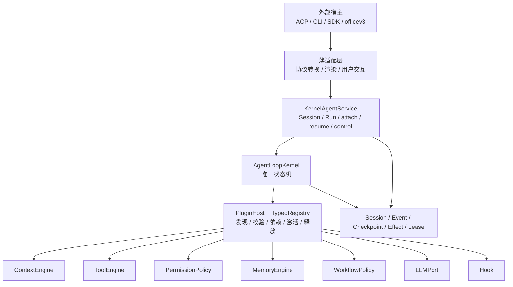
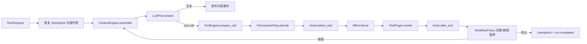

# Box-Agent 架构

## 一句话原则

Box-Agent 只有一个执行内核：`AgentLoopKernel`。ACP、CLI、SDK 与历史
`Agent.run_events()` 只是输入输出适配器；Context、Tool、Permission、Memory、
Workflow、Hook、LLM 和持久化都通过插件注册，不在 Loop 中写产品逻辑。



依赖只向下：Kernel 不导入 ACP、CLI、officev3 或具体工作流；Adapter 不复制
调度、权限和恢复逻辑。`box_agent.agent`、`core`、`runtime` 等根模块是稳定导入
facade，执行仍进入同一个 Kernel；旧 Agent Loop 已删除。

## 每个目录与文件的作用

```text
box_agent/
├── api/                 稳定协议：DTO、事件、控制命令、错误、Port、Handle
├── kernel/              唯一 Agent Loop 与按 Run 组装器
├── services/            Session/Run 生命周期、重放、租约、控制路由
├── plugins/             manifest、typed registry、依赖、生命周期
├── context/             ContextEngine、贡献器、压缩与资源账本
├── tools/               Tool 插件、ToolEngine、MCP 动态暴露、工作区安全
├── permissions/         Executor 之前的 fail-closed 权限网关
├── memory_engine/       Memory SPI、store.py 存储、maintenance.py 维护任务
├── workflows/           Goal/Plan/PPT/Skill/Completion/Autopilot 策略
├── persistence/         Session/Event/Checkpoint/Effect/Lease 持久化
├── llm/                 Provider 适配、流式响应、能力与路由
├── adapters/            ACP/CLI/SDK 输入输出翻译；cli/app.py 是 CLI 实现
├── acp/                 轻量 ACP 握手、Kernel 后台组装和协议专属上下文
├── compat/              历史 API/事件形状到 Kernel 协议的单向翻译
├── observability/       日志、trace、脱敏 Hook
├── skills/              内置 Skill 与运行资源
├── agent.py             历史 Agent 导入 facade
├── core.py              历史 Core helper facade；不含 Loop
├── runtime.py           Kernel 组合与兼容调用入口
└── cli.py               稳定 CLI 启动 facade；实现位于 adapters/cli/app.py
```

关键文件：

| 文件 | 唯一职责 |
| --- | --- |
| `api/contracts.py` | `RunRequest/RunOptions/RunResult`、Message、Tool、Artifact DTO |
| `api/workflows.py` | Workflow action/checkpoint DTO；`api/ports.py` 是 WorkflowPolicy 唯一定义 |
| `api/events.py` | 有序、可持久化的 `AgentEvent` |
| `api/controls.py` | 外部控制命令与幂等 ACK |
| `api/ports.py` | Context/Tool/Permission/Memory/LLM/Hook/Workflow SPI |
| `api/handles.py` | `AgentLoop`、`AgentService`、`AgentRunHandle` |
| `kernel/loop.py` | context → model → tool → continuation → terminal 的通用状态机 |
| `kernel/composer.py` | 按 PluginHost 与 RunOptions 解析本轮组件 |
| `kernel/workflow_composite.py` | 对已注册 workflow policy 做通用组合，不含具体业务策略 |
| `services/kernel.py` | session、run、attach/resume、事件提交、租约和恢复 |
| `plugins/builtins.py` | ACP/CLI 共用的一份内置 workflow/plugin 组装 |
| `tools/engine.py` | schema → validate → permission → hook → effect fence → executor → result |
| `plugins/host.py` | discover → validate → resolve dependencies → activate → dispose |
| `persistence/sqlite.py` | Event/Checkpoint/Effect/Lease 的事务事实源 |
| `compat/runtime.py` | 旧参数/事件形状与稳定协议互转，不实现第二套调度 |
| `adapters/cli/app.py` | CLI 命令、终端交互与事件渲染；任务执行委托给 Service |
| `acp/bootstrap.py` | 先建立 stdio/完成握手，再在后台加载重依赖；只转发 ACP 方法 |
| `acp/kernel_runtime.py` | 将配置和插件组装为 `KernelACPRuntime`，不拥有协议传输或第二套 Loop |
| `llm/__init__.py`、`llm/llm_wrapper.py` | 保持 LLM facade 轻量；只在创建所选 provider 客户端时加载对应厂商 SDK |
| `memory_engine/store.py` | 长期记忆索引、检索与写入实现 |
| `memory_engine/maintenance.py` | 记忆整理、压缩和维护任务 |
| `context/experts.py`、`evidence.py` | 专家上下文贡献与检索证据规范化 |
| `workflows/completion.py`、`guards.py`、`delivery.py` | 交付意图、完成门和纯策略判断 |
| `workflows/execution_profile.py`、`turn_policy.py` | 执行档位与轮次分类 |
| `persistence/artifacts.py`、`roadmap_artifacts.py` | 产物协议、命名、扫描和元数据验证 |
| `observability/logger.py`、`session_trace.py`、`cache_fingerprint.py` | 可脱敏日志、会话 trace 和请求指纹 |
| `compat/events.py`、`hooks.py` | 历史事件/Hook 形状到新协议的兼容边界 |

## 核心输入输出协议

```python
session = await service.open_session(SessionOpenRequest(session_id="s1"))
handle = await service.start(RunRequest(
    request_id="req-1",
    session_id=session.session_id,
    turn_id="turn-1",
    user_input=Message.user("分析当前项目"),
    options=RunOptions(workflow_id="completion_gate"),
))

async for event in handle.events(after_sequence=0):
    render(event)
result = await handle.wait()
```

- 输入：不可变 `RunRequest`，包含 session、turn、用户消息、附件、RunOptions。
- 流式输出：有单调 sequence 的 `AgentEvent`，所有重要边界均是事实。
- 终态输出：`RunResult`，包含内容、停止原因、usage、artifact 和 metadata。
- 外部控制：`handle.send(ControlCommand(...))`；`command_id` 保证幂等。
- 观察与接管：`attach(run_id)` 只读；`resume(run_id)` 显式获取 worker lease。

Loop 的固定顺序：



权限在 Executor 之前执行；Hook 修改参数后必须重新校验权限。Kernel 只识别通用
协议，不识别 PPT、Goal 或某个第三方产品名。

## 插件协议

`PluginHost` 的主要 registry：`llm`、`context`、`context.contributors`、
`memory`、`tools.descriptors`、`tools.executors`、`tools.engines`、
`tools.session_contributors`、`permissions`、`workflows`、
`workflow.selectors`、`hooks`、`sessions`、`events`、`checkpoints`、
`effects`、`leases`、`control.routes`、`host.extensions`、
`host.projections`。
历史短名 `llm/context/tools/memory/permissions` 与对应 canonical typed
registry 指向同一对象，因此注册、热更新、释放和恢复锁都只有一个事实源。

第三方增加任意组件：

```python
from box_agent.plugins import PluginHost
from box_agent.services import KernelAgentService

host = PluginHost()
host.registries["llm"].register("default", my_llm, source="acme.llm")
host.registries["context"].register("default", my_context, source="acme.context")
host.registries["memory"].register("default", my_memory, source="acme.memory")
host.registries["tools.executors"].register("ticket.create", ticket_tool,
                                           source="acme.ticket")
host.registries["workflows"].register("release", release_policy,
                                      source="acme.release")
service = KernelAgentService.from_plugin_host(host)
```

可分发插件在 `pyproject.toml` 声明 `box_agent.plugins` entry point；宿主执行
`PluginHost.discover()` 和 `activate_many()`，核心代码无需修改。注册项必须给出
稳定 key、source、version/state schema；依赖冲突、缺失或重复注册失败闭合。

若第三方只调用核心 Loop，也应从 `KernelAgentService.from_plugin_host(host)` 进入，
让 Composer 完成 session、插件锁和恢复绑定；直接构造 Kernel 仅用于测试。

## 任意持久化点继续运行

系统不保存 Python 调用栈，而保存可重放事实：

1. `SessionStore` 保存逻辑会话与 metadata。
2. `EventLog` 保存每个外部可见状态变化及严格 sequence。
3. `CheckpointStore` 保存消息、计数器、工作流状态、context digest 和 plugin lock。
4. `EffectLedger` 在副作用工具前写 `running`，完成后写结果；重放已完成结果，
   对未知副作用失败闭合，避免重复执行。
5. `LeaseStore` 保证同一 Run 只有一个执行者。
6. 恢复时校验 event digest、checkpoint schema 和 plugin lock；不一致即拒绝恢复。

因此进程可在 model、tool、workflow pause 或 terminal 边界退出。新进程
`load_session` 后 `attach` 查看事实，或显式 `resume` 从最后一个已提交边界继续。

## 架构验收标准

- ACP、CLI、SDK 和历史 Agent API 最终都进入 `AgentLoopKernel`。
- Kernel 不导入 host 或具体工作流模块。
- Context、Tool、Permission、Memory、Workflow、Hook、LLM、Store 可独立替换。
- 工具执行固定为 validate → permission → hook/revalidate → effect → execute。
- 所有事件有稳定 identity、sequence 和可重放 payload；terminal 恰好一次。
- 任意重启不会重复已确认副作用，也不会在插件版本不一致时静默恢复。
- Goal、Plan、PPT、Skill、Completion Gate、Autopilot parity fixture 全部通过。
- ACP E2E 覆盖文本、权限、Context/Memory、continuation、持久化 resume，并生成
  `tests/e2e/report.html` 可视化报告。
- `tests/parity/migration_status.json` 中 `legacy_loop_retired=true` 且 blocker 为空。

实现状态与测试证据见
[`runtime-capability-matrix.md`](runtime-capability-matrix.md)；第三方接入见
[`INTEGRATION.md`](INTEGRATION.md)；ACP E2E 见
[`e2e/ACP_E2E_GUIDE_CN.md`](e2e/ACP_E2E_GUIDE_CN.md)。
