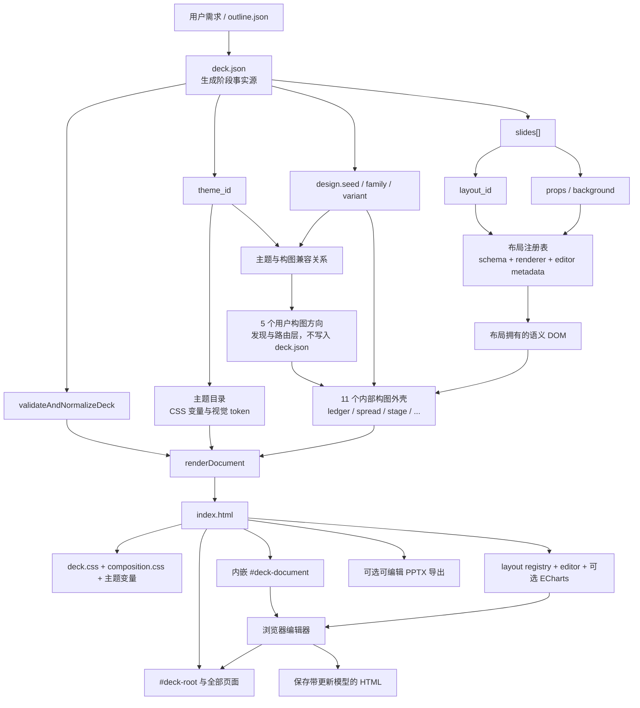

# 受控 HTML PPTX 架构

受控 PPTX 路线把结构化 `DeckDocument` 编译成自包含、可编辑的 HTML 演示文稿。
默认交付物是 `index.html`；`deck.json` 保留为可复现的生成模型，可编辑 PPTX 是可选
导出物。

## 组装模型

`deck.json` 不是第五个视觉层，而是选择并承载以下四层的文档模型：

1. `theme_id` 选择颜色、字体、形状、表面与装饰 token。
2. `design.family + design.variant` 选择页面级 HTML 构图。
3. `slides[].layout_id` 选择已注册的语义布局与字段契约。
4. `slides[].props` 提供文字、媒体、表格、图表等具体内容。



布局 renderer 负责字段含义、容量、DOM 和可恢复数据；构图外壳负责更大的阅读路径和
页面语法；主题 token 同时为二者提供视觉样式，但不改变语义字段契约。
五个“构图方向”只是用户选择与 AI 路由视图：它把十一家族翻译成可理解的选项，最终
仍由 `design.family` 决定运行时外壳，因此不会产生第二份可漂移状态。

## 事实源生命周期

生成阶段：

```text
outline.json -> deck.json -> validate -> render -> index.html
```

对于一句话的事实型需求，受控检查点会在前面增加一段可恢复的研究交接：

```text
output/research/* -> 研究 QA -> outline.json -> deck.json -> index.html
```

演示制作工具以产物根目录为工作目录，因此工具看到的相对路径 `research/`，在宿主
工作区中实际是 `output/research/`。新鲜且成功的研究报告会让文件系统检查点进入
`outline`；搜索与浏览器读取使用独立的受限证据预算，任务续跑时可以复用这份已验证
交接中的 URL，不需要重新做一遍广泛搜索。
如果 officev3 或打包 runtime 重启，用户一句简短的“继续”会从这些持久化产物恢复
尚未完成的受控任务；已经拥有新鲜 7/7 QA 的 deck 不会被重新打开。大纲校验失败时，
检查点进入 `outline_repair`，自包含的 `REPAIR_INPUT` 会给出准确问题、当前完整大纲、
允许复用的研究 URL 与不受支持的 URL。该阶段只允许一次受保护的 `write_file` 修复
（或一次聚焦的用户补充请求），从机制上阻止重复读取、临时 shell 改写和来源绕过。

分块 `write_file` 尚未收到 `final=true` 时，Workflow 会把目标路径、下一块索引和
累计大小写入 `pending_write` checkpoint，并以 `WRITE_PENDING` 暂停。恢复后只能
继续同一事务、显式丢弃，或在工具已清理时重新开始；不能把半成品当作已交付文件。
图片状态同步和 HTML self-check 还在 Bash/Jupyter 工具边界做命令 token 校验，因而
即使没有选中 PPT Workflow，也不能用包装命令或链式命令绕过最终检查。

renderer 会把规范化文档写入
`<script type="application/json" id="deck-document">`。浏览器编辑器读取该模型，
修改 `props` 或 `layout_id`，再通过同一份内嵌布局注册表重新渲染。

HTML 内编辑并保存后，内嵌 `#deck-document` 是该 HTML 产物的事实源。浏览器不会
静默改写旁边的 `deck.json`，因此原始可复现输入和编辑后的 HTML 可能产生版本差异。

## 当前主题到构图规则

当前实现采用“默认家族 + 兼容白名单”。`THEME_COMPOSITION_FAMILY` 继续维护旧主题的
默认值，保证已有输出不变；主题文件也可以直接声明完整策略：

```json
{
  "composition": {
    "default_family": "editorial-spread",
    "allowed_families": [
      "editorial-spread",
      "literary-minimal",
      "poster-asymmetric"
    ]
  }
}
```

默认映射示例：

```text
studio             -> poster-asymmetric
blue-professional  -> institutional-grid
biennale-yellow    -> editorial-spread
retro-windows      -> retro-interface
```

规则是：

- 没有显式选择时使用 `default_family`，保持旧结果；
- 面向用户展示 `composition.directions`，而不是要求用户理解 11 个 family id；
- AI 把 `directions[].families` 的 id 与 `composition.families[].selection_signals`
  对应后解析为具体家族；
- AI 或用户只能从 `allowed_families` 选择其他家族；
- `inspect_deck_contract.js --family <FAMILY_ID>` 在 scaffold 时持久化该选择；
- 已持久化且兼容的 `design.family` 在验证、编辑、重开和导出时保留；
- 未注册家族会报错，不兼容家族会被拒绝或在旧文档规范化时回退到默认值；
- `design.seed` 只在最终选定的家族内确定性选择 variant。

因此当前关系是：

```text
主题 -> 兼容白名单 -> 可用构图方向 -> 内容选择 family -> seed 选择 variant
```

这样既增加创意空间，也不会开放未经视觉验证的任意“主题 × 构图”组合。

## 5 个用户构图方向

| 方向 | 内部家族 | 用户何时选择 |
| --- | --- | --- |
| `structured-systems` 结构与证据 | institutional / analytical / technical | 商业汇报、数据决策、系统说明 |
| `narrative-pages` 编辑与叙事 | editorial / literary | 研究、长文、连续故事 |
| `visual-impact` 视觉冲击 | poster / cinematic | 品牌、人物、画面驱动内容 |
| `interface-modules` 产品与界面 | product / retro | 产品功能、数字体验、界面隐喻 |
| `expressive-objects` 表达性构件 | playful / brutalist | 教育社区、鲜明态度、实验表达 |

方向不写入 `deck.json`。主题先过滤掉不兼容家族；用户选择或 AI 推断方向后，再从该
方向与主题白名单的交集中选出具体 family。这样用户只面对 5 个选择，而 renderer 仍
获得精确的 11 家族之一。

## 11 个构图家族

| 家族 | 主要阅读路径 | 适合场景 |
| --- | --- | --- |
| `institutional-grid` | 规整网格、信息轨道 | 企业汇报、咨询、研究 |
| `editorial-spread` | 杂志跨页、长短文混排 | 趋势、品牌故事、文化内容 |
| `poster-asymmetric` | 非对称大标题、强视觉锚点 | 发布、宣言、创意提案 |
| `playful-collage` | 拼贴、错位、轻松节奏 | 教育、活动、社区、消费品牌 |
| `brutalist-frame` | 粗框、硬边、块面 | 设计作品集、新锐品牌 |
| `retro-interface` | 窗口、终端、像素面板 | 游戏、复古科技、实验项目 |
| `literary-minimal` | 窄栏、边注、大留白 | 思想表达、演讲、长文摘要 |
| `product-showcase` | 设备舞台、浏览器叙事、功能流 | 产品发布、SaaS、Demo、案例 |
| `cinematic-canvas` | 大画面、电影遮幅、章节切换 | 路演开场、品牌影片、人物故事 |
| `analytical-exhibit` | 证据轨道、决策看板、展板网格 | 董事会、数据汇报、策略评审 |
| `technical-schematic` | 蓝图网格、连线节点、规格页 | 架构、工程、科研、技术方案 |

同一主题可以兼容多个家族，但不是任意组合；同一 deck 只选一个家族，页面语义仍由
15 个 `layout_id` 决定，家族负责整套演示的宏观阅读方式。

variant 可以拥有少量专属 HTML 锚点，但不得复制布局负责的可编辑字段。界面隐喻必须
跟内容语义绑定：浏览器条只服务 `browser-story` 的媒体页，系统总线只属于
`annotated-system`，证据刻度只属于 `evidence-rail`。机构、文学、产品、分析和技术这类
信息型家族还会主动压制主题 DNA 里的重复胶囊/胶带标签；趣味、复古等表达型家族可以
在它确实构成视觉语言时保留这些形状。

## 扩展边界

实现与验证应分离：

| 变更 | 只实现一次 | 需要验证 |
| --- | --- | --- |
| 主题 | 一份主题定义和可选资源 | 代表性布局及其兼容构图 |
| 布局 | schema、renderer、编辑 metadata、导出映射 | 全部构图家族 |
| 构图家族 | HTML 外壳、锚点、CSS、variants | 全部已注册布局 |

目标是“加法实现、笛卡尔积验证”，而不是为每个组合复制代码。15 个布局和 11 个构图
应当是 26 份主要实现和 165 个自动兼容性检查，而不是 165 套独立 renderer。

## 关键实现文件

- `scripts/deck_spec_core.js`：DeckDocument 验证与规范化。
- `scripts/composition_core.js`：5 个方向、11 个家族、兼容白名单与 seed variant。
- `layouts/registry.js`：布局契约与构图 HTML 外壳。
- `scripts/finalize_controlled_deck.js`：按依赖顺序一次完成 spec/truth/media 校验、HTML 编译、自检与运行时探测，遇到首个可修复问题即停止。
- `scripts/render_deck_html.js`：完整 HTML 组装。
- `runtime/deck-editor.js`：浏览器编辑、重渲染和保存。
- `scripts/html_to_editable_pptx.js`：可选可编辑 PPTX 导出。

skill 级运行契约继续以
`box_agent/skills/document-skills/pptx/references/controlled-layouts.md` 为准。
