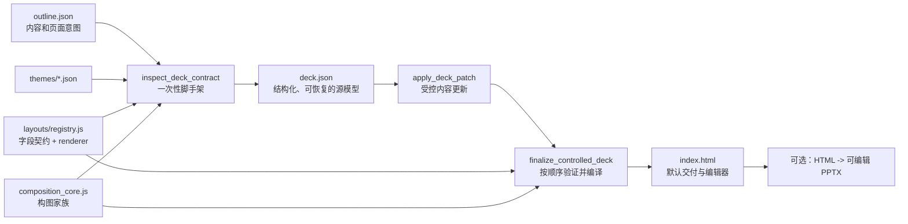

# 受控 HTML PPT 开发与扩展手册

本文面向维护 `box_agent/skills/document-skills/pptx/` 的开发者。它说明怎样在不破坏
“可编辑、可验证、可导出”契约的前提下扩展受控 HTML PPT。产品和数据模型的全景说明见
[受控 HTML PPT 架构](PPTX_CONTROLLED_HTML_ARCHITECTURE_CN.md)；运行中的 Agent 指令仍以
`box_agent/skills/document-skills/pptx/SKILL.md` 为准。

## 1. 先建立正确的心智模型

默认交付链路只有一条：



`deck.json` 是唯一的生成模型；`index.html` 是它的确定性编译结果。用户在 HTML 编辑器中
保存后，HTML 内嵌的 `#deck-document` 成为那份 HTML 副本的模型，但不会静默回写同目录的
`deck.json`。

视觉职责必须保持分离：

| 层 | 负责什么 | 不负责什么 |
| --- | --- | --- |
| `theme_id` | 颜色、字体、形状、表面 token | 页面字段和业务语义 |
| `design.family / variant` | 整套 deck 的阅读路径、页面外壳 | 复制或重命名布局字段 |
| `layout_id` | 页面语义、字段容量、可编辑 DOM | 主题配色与跨页风格 |
| `props` | 当前页的文案、媒体、图表、表格数据 | 改变 layout、theme、family |

因此，“换颜色”通常改主题，“加一类页面”改布局，“让同一套内容有另一种整套阅读方式”改
构图家族；不要用 CSS 覆盖或模型提示词去代替其中任何一个层次。

## 2. 文件地图：先看哪里，再动哪里

| 目标 | 主要入口 | 常见伴随修改 |
| --- | --- | --- |
| 主题选择与兼容性 | `themes/*.json`、`scripts/theme_selection_core.js` | `scripts/composition_core.js`、主题选择测试 |
| 新增/修改页面布局 | `layouts/registry.js` | `runtime/deck.css`、`runtime/deck-editor.js`、导出映射、测试 |
| 构图家族和 variant | `scripts/composition_core.js`、`runtime/composition.css` | `layouts/registry.js` 中的组合外壳、全布局兼容测试 |
| `deck.json` schema/规范化 | `scripts/deck_spec_core.js` | `inspect_deck_contract.js`、`validate_deck_spec.js`、测试 |
| 内容补丁容错 | `scripts/apply_deck_patch.js` | 对应字段契约与回归测试 |
| 事实和来源规则 | `scripts/validate_deck_truth.js` | `references/outline.md`、truth 测试 |
| HTML 编译和最终闸门 | `scripts/render_deck_html.js`、`scripts/finalize_controlled_deck.js` | `html_self_check.js`、`probe_deck_runtime.js` |
| HTML 编辑器 | `runtime/deck-editor.js` | registry 内嵌、编辑器控制 metadata |
| 图表和 PPTX 导出 | `runtime/chart-runtime.js`、`scripts/html_to_editable_pptx.js` | ECharts/PptxGenJS 映射与导出测试 |

以下文件是生成物或产物，**不要手改**：

- `layouts/manifest.json`：由 `build_layout_manifest.js` 从 registry 和主题生成。
- 受控路线的 `index.html`：由 `render_deck_html.js` 生成。
- 新 deck 的顶层 `deck.json`：必须由 `inspect_deck_contract.js` 脚手架生成；内容只经
  `deck.patch.json` + `apply_deck_patch.js` 更新。

## 3. 三类扩展的标准做法

### 3.1 新增主题

主题文件是可执行的视觉 token 和选择元数据。复制最接近的 `themes/*.json`，不要只改颜色。

1. 填写唯一 `id`、`name`、`description`。
2. 完整定义 `selection`（情绪、行业、密度、明暗、正式度），让自动匹配可解释。
3. 定义 `palette`、`typography`、`shape`、`style`，不要依赖浏览器默认值。
4. 在 `composition` 中给出 `default_family`、`allowed_families`、面向用户的
   `directions` 和各 family 的选择信号。
5. 重建 manifest，运行主题选择与主题画廊回归。

主题不是布局的 1:1 副本。一个主题可以允许多个兼容构图家族；一个 deck 在 scaffold 后只
持久化其中一个 `design.family`，再由 `design.seed` 决定 family 内 variant。

### 3.2 新增布局

布局是“语义 + 容量 + 可编辑 DOM”的原子单元。只在 `layouts/registry.js` 注册一次：

1. 定义 `id`、`roles`、`density`、`contentShape`、`mediaSlots`、`capabilities`。
2. 定义 `fields`：每个可编辑字段必须有类型、容量、required/editor/role；`textField`
   可以带 `description`，用来告诉模型字段的真实用途。
3. 提供完整且能通过校验的 `editor.defaultProps`，并在 `editor.controls` 中暴露用户需要的
   枚举和集合编辑能力。
4. 写 renderer，所有可编辑文字必须通过 `editableText` / `editableTableCell` 输出稳定的
   `data-prop-path`。不要把可恢复数据只画进 SVG 或 canvas。
5. 在 `runtime/deck.css` 增加本布局的最小样式；不要用一个全局选择器影响其他布局。
6. 若布局有可导出的图表或专有形状，补齐 `html_to_editable_pptx.js` 的映射；否则明确它的
   导出降级行为。
7. 运行 manifest 构建和契约、渲染、编辑器、导出回归。

字段名表达用途比“给模型一个更大的字符数”更重要。例如 `source` 是短来源脚注，页尾的
业务结论应使用 `insight`。对可识别的历史误填可在 `apply_deck_patch.js` 做无损/可记录的
规范化；不要让一个 optional caption 的长度错误阻断整份 deck。

### 3.3 新增构图家族

构图家族改变页面外围的阅读语法，不改变每个 layout 的字段契约。

1. 在 `composition_core.js` 注册 family、variant 和五个用户方向的关系。
2. 在主题白名单中明确哪些主题可使用该 family；不要默认开放全部主题组合。
3. 在 registry 的组合包装层添加最少的结构锚点，在 `composition.css` 写 family/variant
   级样式。
4. 禁止复制 layout 的标题、列表、图表、表格字段；它们仍由 layout renderer 输出。
5. 对每个已注册 layout 运行渲染/自检/运行时探针。新增一个 family 是“实现一次、验证所有
   布局”，不是复制 N 套 layout。

## 4. 内容约束和修复规则

`deck_spec_core.js` 是字段类型、容量、媒体路径、outline binding 和 design 兼容性的最终
裁判。`apply_deck_patch.js` 只能做确定性、可记录的容错，例如：

- 别名映射到已注册字段；
- 裁剪超过集合容量的可选/重复项；
- 用 `—` 填补表格或甘特图的空单元格；
- 将明显误填到 `source` 的“需求—方案—价值”文字迁移到 `insight`；
- 将普通超长来源脚注压缩为视觉可容纳的短 caption，并把变更写入
  `normalization_changes`。

不要在 normalizer 中：篡改 `truth_contract.source_facts`、改变 slide id/order/layout、静默
编造事实、截断用户必须保留的标题，或用 `待补充` 伪造一次通过。

修复失败时按报告给出的 `slides.<slide-id>.props.<field>` 精确修改。若同一补丁未改变内容就
重复运行，既不会变好，也会触发防循环保护；应该修改被点名字段或补齐适当的 normalizer。

## 5. 每次修改的验证顺序

在仓库根目录执行。先做最小验证，再扩大范围：

```bash
node box_agent/skills/document-skills/pptx/scripts/build_layout_manifest.js --check
uv run pytest tests/test_pptx_controlled_deck.py -q
```

对真实或最小 fixture 做端到端回放：

```bash
cd "<artifact-output-dir>"
PPTX_SKILL_DIR="<Box-Agent-checkout>/box_agent/skills/document-skills/pptx"
node "$PPTX_SKILL_DIR/scripts/apply_deck_patch.js" deck.json deck.patch.json
node "$PPTX_SKILL_DIR/scripts/finalize_controlled_deck.js" deck.json --out index.html
```

`finalize_controlled_deck.js` 依序产生或刷新 spec、truth、image manifest、HTML self-check 和
runtime probe 报告。不要在成功路径中拆开重跑这些子步骤；一次 focused repair 后再次跑
finalizer 才能避免使用过期 QA。

视觉、编辑和导出改动还要人工检查：页面不溢出、编辑器写回同一 `data-prop-path`、播放中的
图表动画不影响静态阅读、导出 PPTX 的图表仍是可编辑数据而不是截图。

## 6. 打包到 officev3 前的检查

源代码测试不等于宿主实际使用了新 skill。涉及 officev3 时，必须额外验证：

1. 用目标版本重建并安装 Box-Agent runtime。
2. 重启 officev3 的 Electron 开发服务。
3. 从应用发起一份真实 deck，确认日志中的 runtime 版本和 skill digest 已更新。
4. 检查 `output/` 的 `deck.json`、`qa/`、`index.html`，再在应用内打开并保存一次 HTML。

常用本地命令（版本号按发布目标替换）：

```bash
cd "<Box-Agent-checkout>"
uv run box-agent-build-runtime --version <version> --install-officev3

cd "<officev3-checkout>"
npm run electron-dev-debug-turbo
```

## 7. 提交前清单

- [ ] 改动落在正确层：theme、layout、composition、model/validator、editor 或 export。
- [ ] 未手改 manifest、生成的 `index.html` 或已 scaffold 的顶层 deck 结构。
- [ ] 新字段有容量、defaultProps、编辑 metadata、renderer 和样式。
- [ ] 新主题/家族有明确兼容白名单，而不是任意组合。
- [ ] normalizer 的每一条自动修复都有回归测试与可读的 change record。
- [ ] 运行 manifest check、聚焦测试和至少一个真实 artifact finalizer。
- [ ] 如影响 officev3，已验证打包 runtime，而非只验证源码。

## 8. 推荐阅读顺序

第一次进入这个子系统，按下面顺序阅读即可，不必先通读大量实现：

1. 本手册；
2. [受控 HTML PPT 架构](PPTX_CONTROLLED_HTML_ARCHITECTURE_CN.md)；
3. `references/controlled-layouts.md`（运行时约束）；
4. `layouts/registry.js` 中目标布局和相邻布局；
5. 与改动同类的 `tests/test_pptx_controlled_deck.py` 测试；
6. 最后才读取对应 renderer、validator 或 exporter 的局部代码。
