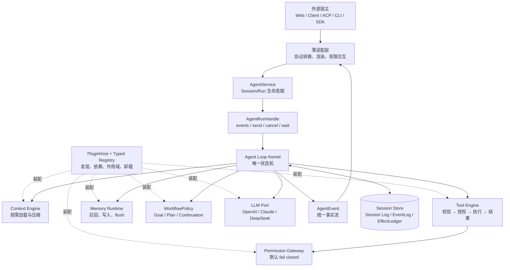
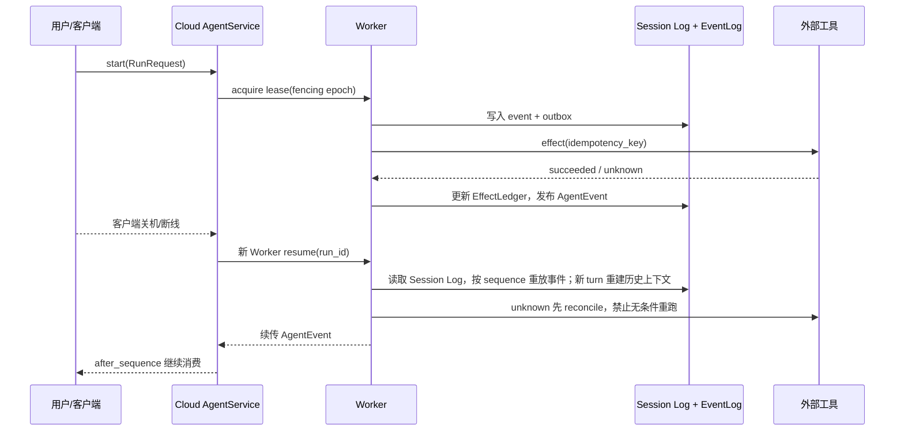
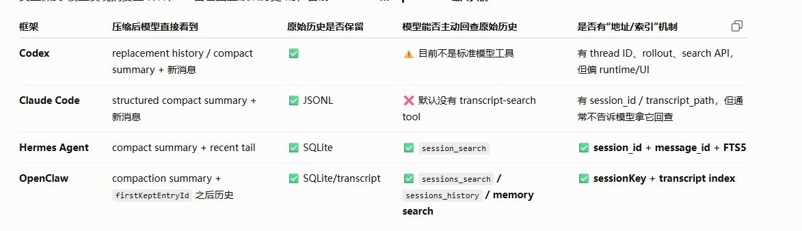
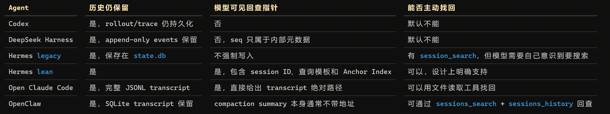
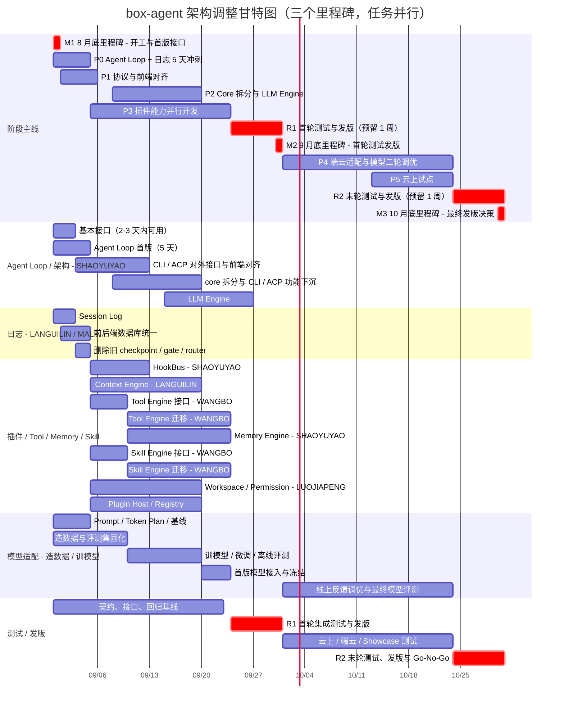

# box-agent 架构调整规划（老板汇报版）

> 版本：V1.0｜日期：2026-08-27｜主题：重构 + 端云 + 可扩展

> 状态更新（2026-09-03）：统一 Kernel、PluginHost、KernelAgentService、薄
> CLI/ACP/SDK adapter，以及 Goal/Plan/PPT/Skill/Completion Gate/Autopilot
> workflow parity 已在当前源码完成；`tests/parity/migration_status.json` 记录
> `legacy_loop_retired: true`。本文保留最初的经营目标、阶段日期和端云路线，不把
> 尚未完成的云 Worker、生产 SLO、runtime 安装或 live-task 验证描述为已交付。
> 当前技术事实以 [分层架构](ARCHITECTURE_CN.md) 和
> [运行时能力矩阵](runtime-capability-matrix.md) 为准。

## 一、先说结论

建议在**不替换现有线上 Agent**的前提下，用“**统一运行内核 + 插件化能力 + 端云双适配 + 可恢复执行**”完成 box-agent 的渐进式升级，目标在 **2026 年 10 月 30 日前完成云上独立运行和核心场景灰度**。

这次调整不是重写一个新 Agent，而是把现有能力收敛成一条可复用的运行链路：

> **Host → Adapter → AgentService → AgentRunHandle → Agent Loop → Plugin → AgentEvent**

预期直接解决四类经营问题：

1. 客户端关机后定时任务无法执行：通过云上 Worker、统一 Session Log、事件序列和幂等账本实现断点续跑。
2. 网页端维护成本高、端上能力重复建设：Web、客户端、ACP、CLI 统一消费同一个 Agent Loop 和事件协议。
3. 工具/Skill/MCP 一次性加载过多、速度和稳定性受影响：常用能力内置，专用能力按需发现、分层加载并支持热更新。
4. 代码耦合导致迭代慢、扩展风险高：Context、Tool、Permission、Memory、LLM、Workflow 全部通过 Plugin SPI 接入，新增能力不改主循环。

## 一页总览（汇报主表）

| 方向 | 当前痛点 / 机会 | 调整方案 | 交付节点 | 验收指标 | 责任域 |
|---|---|---|---|---|---|
| 稳定性止血 | 任务超时、Token Plan 影响速度 | 精简 Prompt、建立场景基线、先关闭 P0 缺陷 | 9/4 | P0 清单关闭；基线可复现 | Kernel / 模型 / QA |
| 模型适配 | 速度与准确性需要用真实场景验证 | 造数据 → 评测集 → 训/微调 → 效果回归 → 版本冻结 | 9/23 首版；10/23 最终版 | 数据集可复现；模型版本可回滚 | 模型 / 能力 / QA |
| 内核解耦 | `core.py`、ACP、CLI 边界混杂 | 冻结 API；AgentService + Agent Loop + PluginHost；兼容桥接 | 9/19 | 新增插件不改 Kernel；CLI/ACP 行为不变 | 架构 / Kernel |
| 工具与上下文 | Tool/Skill/MCP 全量加载，压缩后固定恢复 6 条 | 常用内置；外置两级搜索、按需加载；压缩后按相关性恢复 | 10/10 | Prompt ≤10k；专用能力按需加载 | 能力 / 模型 |
| 云上可持续执行 | 客户端关机后定时任务无法触发 | Cloud Worker + Session Log + EffectLedger + Lease；首期不设独立 checkpoint | 10/23 | 关机后任务成功率建议 ≥99%；无重复副作用 | 云平台 / 可靠性 |
| 端云一致 | Web 维护成本高；客户端为后续重点 | Web、客户端、ACP、CLI 统一消费 `AgentEvent`，只保留薄适配器 | 10/17 | Web 核心功能 100% 保留；客户端关键场景通过 | Web / 客户端 |
| Workspace / Memory | 目录过多；记忆中心使用率低 | Workspace 先用 Skill/Prompt 软约束；Memory 按领域/任务拆分，失败隔离 | 10/10 | 目录与冲突率可观测；Memory 不拖垮主循环 | 能力 / 产品 |
| 场景验收 | 数据分析、PPT 是高价值场景 | 用 Showcase 做灰度；PPT 效果设为质量门 | 10/30 | Go/No-Go 评审；形成规模化计划 | 产品 / QA |

### 三个必须记住的里程碑

| 里程碑 | 日期 | 必须达成 | 对老板的汇报口径 |
|---|---|---|---|
| <span style="color:#C62828"><strong>M1｜8 月底｜开工与首版接口</strong></span> | <span style="color:#C62828"><strong>8/31</strong></span> | Agent Loop 基本接口、Session Log 进入 5 天冲刺；造数规范和基线用例启动 | 先证明“已有模型能接入、日志可追踪” |
| <span style="color:#C62828"><strong>M2｜9 月底｜首轮测试发版</strong></span> | <span style="color:#C62828"><strong>9/30</strong></span> | API/内核/插件化首版集成；模型首版冻结；完成一周全链路测试与发版 | 形成可演示、可回滚的首版，不在发布周安排新功能 |
| <span style="color:#C62828"><strong>M3｜10 月底｜最终测试发版 / Go-No-Go</strong></span> | <span style="color:#C62828"><strong>10/30</strong></span> | 云上试点、端云适配、最终模型评测、成本/SLO、回滚验证完成 | 决定是否扩大规模化上线，现有线上 Agent 继续保留为兜底 |

## 二、为什么现在必须调整

| 观察到的事实 | 对业务的影响 | 优先级 |
|---|---|---|
| `core.py`、`agent.py`、ACP、CLI 同时承担编排、协议、展示和业务策略 | 一处改动容易影响多入口，维护人力持续增加 | P0 |
| 客户端访问量约为网页端 1/10，但 Token 消耗基本持平；客户端是后续重点 | 需要提升端上体验，同时把重任务迁移到云上 | P0 |
| 数据分析、PPT 使用价值和用量较高；B 端主要依赖网页端 | 不能以重构为理由牺牲现有网页功能，PPT 是关键验收场景 | P0 |
| 访问量、注册量大，但有效使用人数偏低；记忆中心每周约 10 人使用且不会编辑 | 应优先把记忆能力做成后台可用能力，暂不把资源投入复杂的记忆中心 UI | P1 |
| Tool/Skill/MCP 全量加载存在加载失败和上下文膨胀 | 首 token 慢、准确性下降、专用工具不可用 | P0 |
| 上下文压缩后固定恢复 6 条，Workspace 目录容易增多 | 上下文不够精准、Token 浪费、用户空间被占用 | P1 |
| 日志入口不统一，用户打断后恢复链路不完整 | 无法定位问题，也无法保证任务继续和副作用不重复 | P0 |

## 三、调整目标（10 月 30 日的“完成定义”）

### 1. 产品目标

- box-agent 在云上独立运行，承载定时任务和长任务；**现有线上 Agent 保持不动，具备随时回滚能力**。
- Web 接入现有线上功能，功能不丢；交互逐步统一到客户端范式，客户端效果不低于网页端。
- 数据分析、PPT 等高价值场景优先验收；Skill 示例和版本放到云端，降低客户端体积并缩短更新周期。

### 2. 技术目标

- Agent Loop 只负责状态机：turn 顺序、模型调用、工具编排、取消/重试、事件记录和完成判断。
- Context、Tool、Permission、Memory、LLM、Hook、Workflow 通过 SPI/Registry 插件化，可独立替换、测试和卸载。
- 对外只暴露 `RunRequest → AgentEvent → ControlCommand → RunResult`，ACP、CLI、Web、客户端均为薄适配器。
- Session/Run 从“聊天记录”升级为可重放状态机：以 `Session Store + EventLog + EffectLedger + PluginSnapshot + Lease` 支持恢复；新 Kernel 从事件事实重建模型/工具上下文，旧 Agent 由兼容桥接承载。
- 模型适配形成闭环：场景造数据 → 评测集固化 → 训练/微调 → 离线与在线评测 → 版本冻结与可回滚。

### 3. 建议量化指标（9 月 4 日完成基线后锁定最终数值）

| 指标 | 10 月灰度目标 |
|---|---|
| 客户端关机后定时任务 | 云上执行成功率 ≥ 99%（试点范围） |
| 中断恢复 | 模型、工具、权限等待、Context 压缩、Memory flush 五类故障注入均可恢复 |
| 副作用安全 | 已确认的外部副作用不重复执行；同一 Run 无双 Worker 写入 |
| 事件可靠性 | sequence 连续、断线可续传、单 Run 仅一个终止事件 |
| 上下文与加载 | System Prompt 控制在 10k 以内；专用 Tool/Skill 不做全量加载 |
| 模型适配 | 9 月底形成首版可发布模型；10 月底完成最终模型评测、冻结与回滚验证 |
| 兼容性 | Web 核心功能 100% 保留；ACP/CLI 行为通过回归验收 |
| 可扩展性 | 新增 Context/Tool/Memory 插件不修改 Agent Loop |

## 四、目标架构


*图 1：复用原方案中的重构目标架构图。核心关系是“外部宿主 → 薄适配层 → Agent Runtime Kernel → Plugin Host/Registries → 可插拔能力”。*



**边界原则：** Adapter 只翻译，Service 只组装，Kernel 只推进状态，Plugin 提供能力，Store 保存事实。任何工具、插件或适配器都不能绕过 Permission Gateway；新的 ACP/CLI 控制扩展统一注册为 `control.routes`，由 `KernelAgentService` 提供跨重启幂等 ACK 和 `control.received` 事件，不再堆积 `if/elif` 分支。

## 五、关键方案

### 1. 统一接口与渐进式迁移

`api/` 中的 DTO、事件、控制命令、错误码和异步句柄已经冻结；历史
`Agent.run_events()` 通过兼容 facade 映射到 `AgentService.start().events()`。
Agent、ACP、CLI 与 SDK 现在都进入唯一的 Kernel，旧 Loop 与 runtime selector
已经删除。Goal、Plan、PPT、Skill、Completion Gate、Autopilot 均以原生插件实现，
并通过确定性 parity fixture 保留行为。

核心协议：

```text
RunRequest（纯数据）
        ↓
AgentRunHandle
        ├─ AgentEvent：模型、工具、权限、记忆、产物、终止事件
        ├─ ControlCommand：注入、暂停、恢复、取消、权限响应
        └─ RunResult：状态、原因、最终答案、usage、artifacts、error
```

### 2. 可靠性：云上执行 + 任意点恢复



首期不再维护独立 checkpoint；关键运行事实统一写入 Session Log，并以 `sequence` 支持断线续传和恢复。新 turn 会从同一 Session 的历史事实重建上下文，但不会把历史步数计入当前 Run 配额。对外部副作用使用由 Kernel 生成且可被宿主覆盖的稳定 `effect_id/idempotency_key`，通过 Lease/Fencing 与心跳保证同一 Run 同时只有一个 Worker 执行；如后续数据证明全量重放成本过高，再评估引入可选快照。

### 3. 速度与准确性：渐进式披露

- System Prompt 先控制在 10k 以内，不把 Tool、Skill、MCP 说明全部塞入上下文。
- 常见能力走固定内置清单；外置能力按“类别搜索 → 精确工具/Skill”两级发现。
- 仅在模型判断需要时加载专用 Tool/Skill，保持已命中的上下文稳定，支持热更新。
- 先优化 Prompt 和加载策略，再评估是否引入 Main Agent → Subagent 的任务拆分，避免过早增加编排复杂度。

### 4. Workspace 与 Context





*图 2：复用原资料中的上下文恢复调研图，支撑“压缩后按需恢复、未压缩时全量加载”的首期策略。*

| 场景 | 首期规则 | 何时升级为硬约束 |
|---|---|---|
| 代码任务 | 用户明确选择工作区 | 监控到真实覆盖冲突且软约束无法降低时 |
| 普通任务 | 只有确有文件产出时才创建目录 | 目录数量或空间占用持续超阈值时 |
| 代码 + 普通混合 | 只在用户指定目录写入；非代码产物放 `tmp/` | 出现跨任务写入冲突时 |

框架首期不做目录级硬隔离，以 Skill/Prompt 约束为主；执行前提示模型先检查目录。上下文未发生压缩时维持全量加载；发生压缩后只恢复与当前 Task 最相关的上下文，其余按需加载，采用简化的相关性排序，先求稳定再优化召回质量。

### 5. Workflow 策略与自进化

- `WorkflowPolicy` 插件承接 Goal、Plan、Approval、Continuation、PPT、Skill 与
  Completion Gate；状态工具按 session 隔离，checkpoint 与事件可重放，旧执行
  状态机已经移除。
- 有 `/goal` 的任务必须检查计划、产物和完成条件；生成图片等简单任务不强制创建复杂计划，但仍需能正常结束。
- Memory 与任务解耦：按数据分析、PPT、文档等领域拆分召回/写入策略，按任务迭代；记忆失败隔离，不拖垮主循环。

### 6. 工具与日志治理

- 工具重新按 Showcase 和业务场景梳理，删除重复项，保证正交性和完整性。
- `ToolExecutionResult` 分离模型可见内容、展示内容、结构化输出、产物和错误，避免结果对象混合多种语义。
- 所有入口统一写入事件流和 SQLite/云端事件存储，覆盖压缩时机、子 Agent、工具调用、权限、产物和错误。
- 每个 Run 通过 `event_id` 去重、`sequence` 续传；日志禁止携带密钥、Token 和未经脱敏的隐私数据。

## 六、实施路线与时间节点

> 时间按 2026-08-27 启动，部分工作并行；每个阶段有可演示、可回滚的出口。

### 甘特图：阶段主线 + 五条并行工作流



**读图方式：** 三个红色里程碑条是向老板汇报的主节点：**8/31 开工与首版接口、9/30 首轮测试发版、10/30 最终发版决策**。Agent Loop、日志、插件能力、模型适配和测试并行推进；9/24–9/30 与 10/24–10/30 两段红色区间为预留的完整测试发版周，不再安排新功能开发。按本轮最新分工，日志专项删除旧 checkpoint / gate / router；云上恢复首期以 Session Log、事件序列、幂等账本和 Lease 实现。

| 阶段 | 时间 | 重点交付 | 阶段目标 |
|---|---|---|---|
| P0 Agent Loop + 日志 5 天冲刺 | 8/31–9/4 | Agent Loop 基本接口、CLI/ACP 对齐起步；Session Log、前后端数据库统一；删除旧 checkpoint/gate/router | <span style="color:#C62828"><strong>8/31：开工与首版接口</strong></span>；2–3 天有基本接口；5 天完成首轮可运行版本 |
| P1 协议与前端对齐 | 9/1–9/5 | `api/`、`AgentEvent`、`ControlCommand`、错误码、插件 manifest；CLI/ACP 与前端协议对齐 | 协议 v1 评审通过；前端可接入；兼容策略确认 |
| P2 Core 拆分与 LLM Engine | 9/8–9/19 | core 拆分、CLI/ACP 功能下沉、AgentService/AgentRunHandle、LLM Engine | 旧 Agent 行为不变；内核与对外接口可独立测试 |
| P3 插件能力并行开发 | 9/5–9/23 | HookBus、Context、Tool、Memory、Skill、Workspace/Permission、Plugin；接口与迁移并行 | 新增/替换能力不改 Kernel；插件启停/卸载无残留 |
| <span style="color:#C62828"><strong>R1 首轮测试与发版</strong></span> | 9/24–9/30 | 全链路、模型效果、工具/Skill、日志恢复、Web/客户端回归；首版模型冻结 | <span style="color:#C62828"><strong>9/30：首轮测试发版</strong></span>；发布周不安排新功能，形成问题清单 |
| P4 端云适配与模型二轮调优 | 10/1–10/10 | Web/客户端/ACP/CLI 统一事件；远程 Skill 示例与热更新；根据 R1 反馈调优模型 | Web 核心功能清单 100% 对齐；客户端关键场景可演示 |
| P5 云上试点 | 10/13–10/23 | 独立 Worker、定时任务、监控告警、灰度开关、回滚脚本；最终模型评测 | 关机后任务可续跑；SLO、成本和模型效果达标 |
| <span style="color:#C62828"><strong>R2 末轮测试与发版</strong></span> | 10/24–10/30 | Showcase（数据分析/PPT/长任务）、云上稳定性、成本、回滚验证 | <span style="color:#C62828"><strong>10/30：最终发版 / Go-No-Go</strong></span>；形成后续规模化计划 |

## 七、组织分工（本轮执行）

| 工作包 | 负责人 | 重点任务 | 计划窗口 |
|---|---|---|---|
| Agent Loop / 架构 | @SHAOYUYAO | 5 天首版；2–3 天基本接口；CLI/ACP 对外接口与前端对齐；core 拆分、功能下沉、LLM Engine | 8/31–9/26（首版 8/31–9/4） |
| 日志 | @LANGUILIN、@MALIN | Session Log；前后端数据库统一；删除旧 checkpoint / gate / router | 8/31–9/4 |
| HookBus | @SHAOYUYAO | HookBus 接口与首版实现 | 9/5–9/12 |
| Context Engine | @LANGUILIN | Context 组装、压缩后按需恢复 | 9/5–9/19 |
| Tool Engine | @WANGBO | 接口定义、工具迁移、MCP/结果治理 | 9/5–9/23 |
| Memory Engine | @SHAOYUYAO | Memory 读写、flush、失败隔离 | 9/10–9/23 |
| Skill Engine | @WANGBO | 接口定义、Skill 迁移、分层搜索和按需加载 | 9/5–9/23 |
| Workspace / Permission Gateway | @LUOJIAPENG | Workspace 规则、权限闸门、授权交互 | 9/5–9/19 |
| Plugin Host / Registry | 待确认 | Plugin manifest、注册、依赖、启停和卸载 | 9/5–9/19 |
| 模型适配 | 模型小组（负责人待确认） | 场景造数据、评测集、训/微调、离线评测、首版/最终版冻结 | 8/31–10/23 |
| 测试与发版 | QA / 产品（负责人待确认） | 契约、集成、故障、端云、Showcase 测试；两次发版周 | 8/31–10/30 |

## 八、主要风险与控制措施

| 风险 | 控制措施 |
|---|---|
| 重构影响线上功能 | 兼容 facade、双轨运行、灰度开关、可回滚；不直接替换现有线上 Agent |
| 云上 Token/算力成本上升 | Context budget、按需加载、并发/配额限制；先以长任务和定时任务试点 |
| 外部副作用重复执行 | EffectLedger + 幂等键 + reconcile；`unknown` 状态禁止盲目重跑 |
| 插件版本和依赖失控 | manifest、语义化版本、依赖环检查、同作用域冲突即失败 |
| Web/PPT 效果回退 | 建立黄金用例和人工验收门；PPT 作为 P0 场景，不以接口通过替代效果通过 |
| Workspace 软约束不足 | 记录覆盖冲突率、目录数量和空间占用；达到阈值后再升级硬隔离 |
| 记忆中心使用率低 | 首期优先后台召回/写入和失败隔离，暂不扩展复杂编辑能力 |

## 九、需要老板拍板的事项

1. **方向**：批准“重构 + 端云 + 可扩展”的目标架构，以及不替换现有线上 Agent 的双轨策略。
2. **节点**：批准 <span style="color:#C62828"><strong>8/31 开工与首版接口、9/30 首轮测试发版、10/30 最终测试发版/Go-No-Go</strong></span> 三个主里程碑。
3. **资源**：确认云 Worker、事件存储/SQLite、远程 Skill 仓库、PPT/数据分析验收资源。
4. **优先级**：确认客户端为后续重点，Web 先保功能、再统一交互；PPT 效果作为关键质量门。
5. **指标**：9 月 4 日前完成基线，届时锁定延迟、Token、恢复成功率、成本和有效使用率的最终目标。

## 十、一句话收束

> 这次架构调整的核心不是“把代码拆得更细”，而是把 box-agent 从**只能在线运行、入口各自维护、能力难以替换**，升级为**云上可持续执行、端云一致、插件可扩展、故障可恢复**的 Agent 基础设施；先小范围试点验证价值，再按数据决定规模化投入。

## 依据文档

- [重构+端云+可扩展方案分工](https://sensetime.feishu.cn/wiki/Yqq3wp1pFi7sCIkZR9FckKB6nTc)
- [整体架构](https://sensetime.feishu.cn/wiki/QRT2w9DC0ig2WkkxQIqcxk2LnGh)
- [接口及验收标准](https://sensetime.feishu.cn/wiki/ReKRwE6lBiOApvkGid0c6ntEnuh)
- [第三方扩展](https://sensetime.feishu.cn/wiki/LhOlwh8aaiDtDPkVKTPc1nMnnJc)
- [workspace 相关（Plan 润色版）](https://sensetime.feishu.cn/wiki/F3a0w9YTEiCKQCksE0dcRo46nMd)
